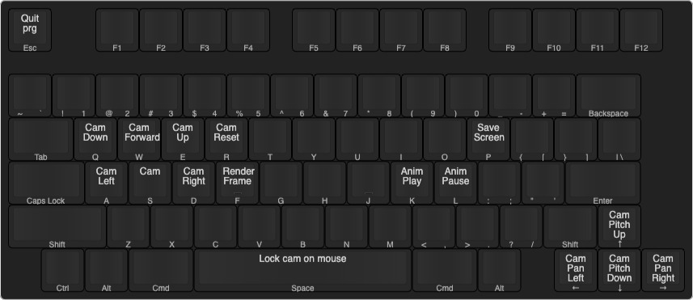

# RT


## Summary
_This is a ray tracing program in C using SDL2 and imgui._
_This project is done during 42 graphic branch to learn about computer-generated images._
_Built and tested on mac OSX 10 & Windows_

## How to install

### On mac :
Install the library required :
```
brew install sdl2
brew install sdl2_image
```
This command will built an app bundle :
```
git clone --recurse-submodules https://github.com/nihuynh/RT && cd RT && make
```

### On Linux :
(Untested)

### On Windows :
(Untested)

### Miscellaneous :
For more info on how to use the makefile :
```
make usage
```
[Doxygen documentation here](https://nihuynh.github.io/RT/t__data_8h.html)
## How to use

### Keymap :


### make video from screenshots :
exemple for the map pool.rt, once the screenshots are generated.
```
ffmpeg -r 30 -f image2 -i pool.rt%d.png -vcodec libx264 -crf 15 -pix_fmt yuv420p pool_30FPS.mp4
```
---
# Features:

* sky-box
* Refraction (Glass)
* Reflection (Mirror)
* Controllable camera
* Screenshot
* Load/Reload/Export scenes
* Live Edit of the scenes
* Under and over-sampling
* UI
* Fullscreen
* Texture on all shapes

## Shape availables:
* Plane
* Cube
* Sphere
* Cylinder
* Cone
* CSG (Constructive Solid Geometry)

### Limited Shape:
* Triangle
* Disk
* Limited plane

# Credit:
http://www.yamllint.com/ : A Must have for travis.
#### Licence:
_This repository is under no license._
